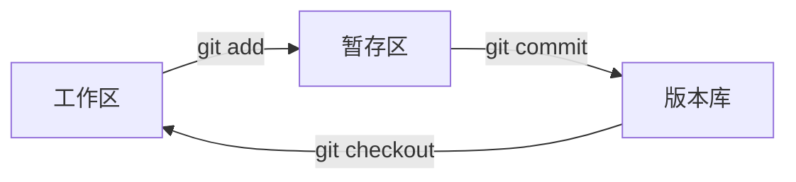

## 前言

本文是学习廖雪峰Git教程的学习笔记，涵盖了Git版本控制系统的基础概念和常用操作。Git是目前最流行的分布式版本控制系统，掌握Git对于软件开发至关重要。

> **注意**：所有Git操作都需要在.git文件所在目录下进行

## 基础概念

### Git的三个区域

Git将文件管理分为三个主要区域：

1. **工作区（Working Directory）**
   - 就是你在电脑里能看到的目录
   - 存放项目文件的地方

2. **暂存区（Stage/Index）** ⭐ **重点**
   - 临时存放文件修改的地方
   - 位于.git目录中的index文件

3. **版本库（Repository）**
   - 工作区有一个隐藏目录`.git`，这就是Git的版本库
   - 包含暂存区和分支信息
   - Git自动创建的第一个分支是`master`（或`main`）

### 工作流程



**核心理念**：
- `git add`命令把要提交的所有修改放到暂存区
- `git commit`一次性把暂存区的所有修改提交到分支

## 基础操作

### 环境准备

推荐使用Git Bash，因为它支持很多Linux命令，在Windows下提供更好的体验。

### 仓库初始化

```bash
# 初始化Git仓库
git init
```

### 文件添加和提交

```bash
# 添加单个文件到暂存区
git add <file>

# 添加所有修改到暂存区 ⭐ 常用
git add .

# 提交暂存区的所有文件到版本库
git commit -m "提交说明"
```

**完整流程示例**：
```bash
# 1. 创建或修改文件
echo "Hello Git" > readme.txt

# 2. 添加到暂存区
git add readme.txt

# 3. 提交到版本库
git commit -m "add readme file"
```

## 状态检查和差异查看

### 查看仓库状态

```bash
# 查看工作区和暂存区的状态
git status
```

**状态示例**：
```bash
Changes to be committed:
  (use "git restore --staged <file>..." to unstage)
        modified:   readme.txt

Changes not staged for commit:
  (use "git add <file>..." to update what will be committed)
  (use "git restore <file>..." to discard changes in working directory)
        modified:   readme.txt
```

### 查看文件差异

```bash
# 查看工作区和暂存区的差异
git diff <file>

# 查看暂存区和版本库的差异
git diff --cached <file>
```

**差异示例**：
```bash
$ git diff readme.txt 
diff --git a/readme.txt b/readme.txt
index 46d49bf..9247db6 100644
--- a/readme.txt
+++ b/readme.txt
@@ -1,2 +1,2 @@
-Git is a version control system.
+Git is a distributed version control system.
 Git is free software.
```

### 查看提交历史

```bash
# 查看详细的提交历史
git log

# 查看简洁的提交历史（推荐）
git log --pretty=oneline

# 查看图形化的分支历史
git log --graph --pretty=oneline --abbrev-commit
```

**历史记录示例**：
```bash
$ git log --pretty=oneline
049c19eb21cbe21986810b7de105d3d7ab584d1c (HEAD -> main) 最新提交
a87bfdefbae52977a72b7955a406eab118a04df5 第二次提交
1dc3373085994a336323614fa726732b582f22f2 初始提交
```

## 版本回退和撤销

### 版本指针概念

- **HEAD**：表示当前版本
- **HEAD^**：上一个版本
- **HEAD^^**：上上个版本
- **HEAD~100**：往上100个版本

### 版本回退

```bash
# 回退到上一个版本
git reset --hard HEAD^

# 回退到指定版本（使用commit id）
git reset --hard 1094adb

# 查看命令历史（找回commit id）
git reflog
```

**回退示例**：
```bash
$ git reset --hard HEAD^
HEAD is now at e475afc add distributed

$ git reflog
e475afc HEAD@{1}: reset: moving to HEAD^
1094adb (HEAD -> master) HEAD@{2}: commit: append GPL
e475afc HEAD@{3}: commit: add distributed
```

### 撤销修改

#### 1. 撤销工作区修改

```bash
# 丢弃工作区的修改（注意--很重要）
git checkout -- <file>

# 或者使用新的命令
git restore <file>
```

#### 2. 撤销暂存区修改

```bash
# 把暂存区的修改撤销，重新放回工作区
git reset HEAD <file>

# 或者使用新的命令
git restore --staged <file>
```

#### 3. 撤销版本库修改

```bash
# 版本回退（如上所述）
git reset --hard HEAD^
```

### 撤销场景总结

| 场景 | 解决方案 |
|------|----------|
| 修改了工作区文件，想撤销 | `git checkout -- file` |
| 修改了文件并添加到暂存区，想撤销 | 先`git reset HEAD file`，再`git checkout -- file` |
| 修改了文件并提交到版本库，想撤销 | `git reset --hard HEAD^` |

## 文件删除操作

### 删除文件的两种情况

#### 1. 确实要删除文件

```bash
# 从工作区删除文件
rm test.txt

# 从版本库删除文件
git rm test.txt

# 提交删除操作
git commit -m "remove test.txt"
```

#### 2. 误删文件，需要恢复

```bash
# 从版本库恢复文件到工作区
git checkout -- test.txt
```

**重要提醒**：
- 只能恢复文件到最新版本
- 会丢失最近一次提交后的修改内容
- 从未添加到版本库的文件无法恢复

## 远程仓库操作

### 关联远程仓库

```bash
# 添加远程仓库
git remote add origin https://github.com/username/repository.git

# 查看远程仓库
git remote -v
```

### 推送到远程仓库

```bash
# 推送到远程仓库的master分支
git push origin master

# 第一次推送时，使用-u参数关联本地和远程分支
git push -u origin master
```

### 从远程仓库克隆

```bash
# 克隆远程仓库到本地
git clone https://github.com/username/repository.git
```

### 从远程仓库拉取

```bash
# 拉取远程仓库的最新内容
git pull origin master

# 或者分两步操作
git fetch origin
git merge origin/master
```

## 分支管理

### 分支基本操作

```bash
# 查看分支
git branch

# 创建分支
git branch <branch-name>

# 切换分支
git checkout <branch-name>

# 创建并切换分支
git checkout -b <branch-name>

# 合并分支到当前分支
git merge <branch-name>

# 删除分支
git branch -d <branch-name>
```

### 分支管理策略

```bash
# 禁用Fast forward模式合并
git merge --no-ff -m "merge with no-ff" dev

# 查看分支历史
git log --graph --pretty=oneline --abbrev-commit
```

## 实用技巧

### 1. 配置Git

```bash
# 配置用户信息
git config --global user.name "Your Name"
git config --global user.email "email@example.com"

# 配置别名
git config --global alias.st status
git config --global alias.co checkout
git config --global alias.ci commit
git config --global alias.br branch
```

### 2. 忽略文件

创建`.gitignore`文件：
```bash
# 忽略所有.log文件
*.log

# 忽略node_modules目录
node_modules/

# 忽略特定文件
config.ini
```

### 3. 标签管理

```bash
# 创建标签
git tag v1.0

# 创建带说明的标签
git tag -a v1.0 -m "version 1.0 released"

# 查看标签
git tag

# 推送标签到远程
git push origin v1.0
git push origin --tags
```

## 常见问题解决

### 1. 合并冲突

当Git无法自动合并分支时，需要手动解决冲突：

```bash
# 查看冲突文件
git status

# 编辑冲突文件，解决冲突后
git add <conflict-file>
git commit -m "resolve conflict"
```

### 2. 暂存工作现场

```bash
# 暂存当前工作现场
git stash

# 查看暂存列表
git stash list

# 恢复暂存的工作现场
git stash pop

# 或者
git stash apply
git stash drop
```

### 3. 修改最后一次提交

```bash
# 修改最后一次提交的说明
git commit --amend -m "new commit message"

# 向最后一次提交添加文件
git add forgotten-file.txt
git commit --amend --no-edit
```

## 最佳实践

### 1. 提交规范

- 提交信息要清晰明了
- 每次提交只做一件事
- 提交前检查代码质量

```bash
# 好的提交信息示例
git commit -m "feat: add user authentication"
git commit -m "fix: resolve login button click issue"
git commit -m "docs: update README with installation guide"
```

### 2. 分支策略

- `master/main`：稳定的生产分支
- `develop`：开发分支
- `feature/*`：功能分支
- `hotfix/*`：紧急修复分支

### 3. 工作流程

```bash
# 1. 从主分支创建功能分支
git checkout -b feature/new-feature

# 2. 开发并提交
git add .
git commit -m "implement new feature"

# 3. 推送到远程
git push origin feature/new-feature

# 4. 创建Pull Request/Merge Request

# 5. 合并后删除分支
git checkout main
git pull origin main
git branch -d feature/new-feature
```

## 总结

Git是一个功能强大的版本控制系统，掌握其基本概念和常用操作对于软件开发至关重要。通过理解工作区、暂存区、版本库的概念，以及熟练使用各种Git命令，可以有效地管理代码版本，提高开发效率。

### 核心要点

1. **三个区域**：工作区、暂存区、版本库
2. **基本流程**：修改 → add → commit → push
3. **版本管理**：使用commit id和HEAD指针
4. **分支管理**：并行开发，合并代码
5. **远程协作**：clone、pull、push

记住这些核心概念和操作，就能够熟练使用Git进行版本控制了！