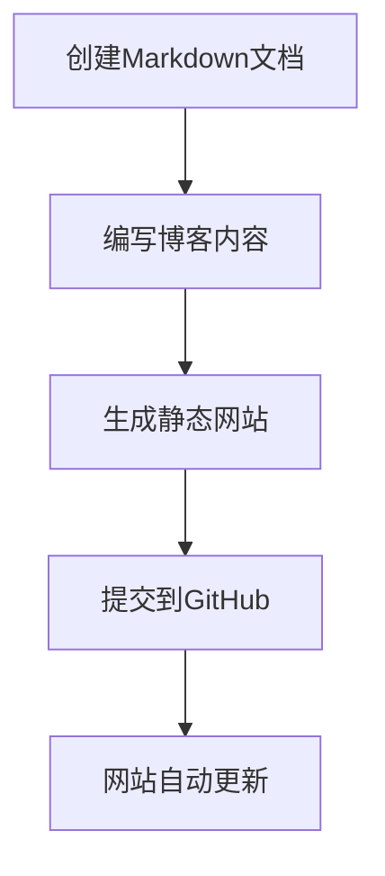

## 前言

本文介绍使用Hugo静态网站生成器搭建的博客网站的日常维护流程。Hugo是一个快速、现代的静态网站生成器，结合GitHub Pages可以轻松搭建个人博客网站。

## Hugo博客发布流程

### 完整工作流程



## 详细操作步骤

### 1. 创建博客文章

在项目的根目录下执行以下命令创建新的博客文章：

```bash
hugo new posts/article-name.md
```

**命令说明**：
- `hugo new`：Hugo的内容创建命令
- `posts/`：文章存放的目录
- `article-name.md`：文章文件名（建议使用英文和连字符）

**示例**：
```bash
# 创建技术文章
hugo new posts/react-hooks-guide.md

# 创建生活随笔
hugo new posts/my-reading-notes.md

# 创建项目介绍
hugo new posts/project-showcase.md
```

### 2. 编写文章内容

创建的Markdown文件会包含基本的前置元数据（Front Matter）：

```yaml
---
title: "文章标题"
date: 2025-02-23T02:39:29+08:00
draft: true
---
```

**完善文章元数据**：
```yaml
---
title: "React Hooks完全指南"
date: 2025-02-23T10:00:00+08:00
draft: false
tags: ["React", "JavaScript", "前端开发"]
categories: ["技术教程"]
description: "深入理解React Hooks的使用方法和最佳实践"
cover:
  image: "/images/react-hooks.jpg"
  alt: "React Hooks"
  caption: "React Hooks让函数组件更强大"
---

# 文章内容开始...
```

**重要字段说明**：
- `title`：文章标题
- `date`：发布日期
- `draft`：是否为草稿（true=草稿，false=发布）
- `tags`：文章标签
- `categories`：文章分类
- `description`：文章描述（用于SEO）
- `cover`：封面图片配置

### 3. 生成静态网站

在项目根目录下执行：

```bash
hugo
```

**命令功能**：
- 读取`content/`目录下的Markdown文件
- 应用主题模板
- 生成静态HTML、CSS、JS文件
- 输出到`public/`目录

**可选参数**：
```bash
# 生成并启动本地服务器预览
hugo server

# 生成草稿内容
hugo -D

# 指定配置文件
hugo --config config.yaml

# 清理并重新生成
hugo --cleanDestinationDir
```

### 4. 提交到GitHub

进入`public`目录（生成的静态文件目录）：

```bash
cd public
```

执行Git操作：

```bash
# 添加所有文件到暂存区
git add .

# 提交更改
git commit -m "update blog content"

# 推送到GitHub Pages
git push origin master
```

**提交信息建议**：
```bash
# 新增文章
git commit -m "add: new post about React Hooks"

# 更新文章
git commit -m "update: fix typos in React Hooks post"

# 网站配置更新
git commit -m "config: update site theme and settings"

# 修复问题
git commit -m "fix: resolve image loading issue"
```

## 高级工作流程

### 1. 本地预览和调试

```bash
# 启动本地开发服务器
hugo server -D

# 指定端口
hugo server --port 1314

# 绑定到所有网络接口
hugo server --bind 0.0.0.0

# 实时重载（默认开启）
hugo server --watch
```

访问 `http://localhost:1313` 预览网站。

### 2. 内容管理策略

#### 文章分类结构
```
content/
├── posts/           # 博客文章
├── about/           # 关于页面
├── projects/        # 项目展示
└── notes/           # 学习笔记
```

#### 文件命名规范
```bash
# 日期前缀命名
2025-02-23-react-hooks-guide.md

# 分类前缀命名
tech-react-hooks-guide.md
life-reading-notes-2025.md

# 简洁命名
react-hooks-guide.md
```

### 3. 自动化部署

#### GitHub Actions配置

创建`.github/workflows/hugo.yml`：

```yaml
name: Deploy Hugo site to Pages

on:
  push:
    branches: ["main"]
  workflow_dispatch:

permissions:
  contents: read
  pages: write
  id-token: write

concurrency:
  group: "pages"
  cancel-in-progress: false

defaults:
  run:
    shell: bash

jobs:
  build:
    runs-on: ubuntu-latest
    steps:
      - name: Checkout
        uses: actions/checkout@v4
        with:
          submodules: recursive

      - name: Setup Hugo
        uses: peaceiris/actions-hugo@v2
        with:
          hugo-version: 'latest'
          extended: true

      - name: Build with Hugo
        run: hugo --minify

      - name: Upload artifact
        uses: actions/upload-pages-artifact@v2
        with:
          path: ./public

  deploy:
    environment:
      name: github-pages
      url: ${{ steps.deployment.outputs.page_url }}
    runs-on: ubuntu-latest
    needs: build
    steps:
      - name: Deploy to GitHub Pages
        id: deployment
        uses: actions/deploy-pages@v2
```

#### 简化的发布脚本

创建`deploy.sh`脚本：

```bash
#!/bin/bash

echo "开始构建Hugo网站..."
hugo

echo "进入public目录..."
cd public

echo "添加文件到Git..."
git add .

echo "请输入提交信息："
read commit_message

if [ -z "$commit_message" ]; then
    commit_message="update blog $(date '+%Y-%m-%d %H:%M:%S')"
fi

echo "提交更改..."
git commit -m "$commit_message"

echo "推送到GitHub..."
git push origin master

echo "部署完成！"
```

使用脚本：
```bash
chmod +x deploy.sh
./deploy.sh
```

## 内容优化建议

### 1. SEO优化

```yaml
---
title: "具体而有吸引力的标题"
description: "简洁明了的文章描述，包含关键词"
keywords: ["关键词1", "关键词2", "关键词3"]
author: "作者名"
canonical: "https://yourdomain.com/posts/article-name/"
---
```

### 2. 图片管理

```markdown
# 本地图片


# 外部图片


# 带链接的图片
[](https://link-url.com)
```

图片存放结构：
```
static/
└── images/
    ├── posts/
    │   ├── 2025/
    │   └── categories/
    ├── covers/
    └── icons/
```

### 3. 代码高亮配置

在`config.yaml`中配置：

```yaml
markup:
  highlight:
    style: github
    lineNos: true
    tabWidth: 2
```

使用代码块：
````markdown
```javascript
function greet(name) {
    console.log(`Hello, ${name}!`);
}
```
````

## 故障排除

### 常见问题及解决方案

#### 1. 构建失败
```bash
# 检查Hugo版本
hugo version

# 检查配置文件语法
hugo config

# 详细错误信息
hugo -v
```

#### 2. 样式丢失
```bash
# 检查baseURL配置
grep baseURL config.yaml

# 重新生成并清理
hugo --cleanDestinationDir
```

#### 3. 图片不显示
- 检查图片路径是否正确
- 确认图片文件存在于`static/`目录
- 检查文件名大小写

#### 4. 文章不显示
- 确认`draft: false`
- 检查日期格式
- 验证Front Matter语法

## 性能优化

### 1. 构建优化

```bash
# 压缩输出
hugo --minify

# 并行处理
hugo --parallel

# 缓存优化
hugo --gc
```

### 2. 图片优化

```yaml
# config.yaml
imaging:
  resampleFilter: "lanczos"
  quality: 85
  anchor: "smart"
```

### 3. 内容优化

- 使用WebP格式图片
- 压缩CSS和JavaScript
- 启用Gzip压缩
- 使用CDN加速

## 总结

Hugo博客的日常维护流程简单高效：

1. **创建内容**：`hugo new posts/article.md`
2. **本地预览**：`hugo server`
3. **生成网站**：`hugo`
4. **部署发布**：`git add . && git commit && git push`

通过自动化脚本和GitHub Actions，可以进一步简化发布流程，专注于内容创作。记住定期备份源码，保持良好的文件组织结构，就能轻松维护一个高质量的个人博客网站！ 😊

## 参考资源

- [Hugo官方文档](https://gohugo.io/documentation/)
- [GitHub Pages文档](https://docs.github.com/en/pages)
- [Markdown语法指南](https://www.markdownguide.org/)
- [Hugo主题库](https://themes.gohugo.io/)